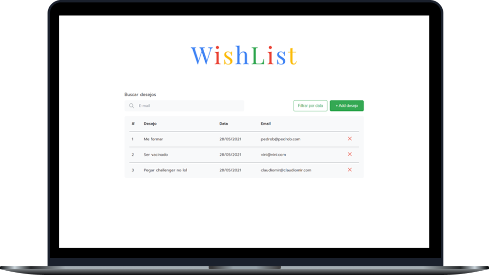
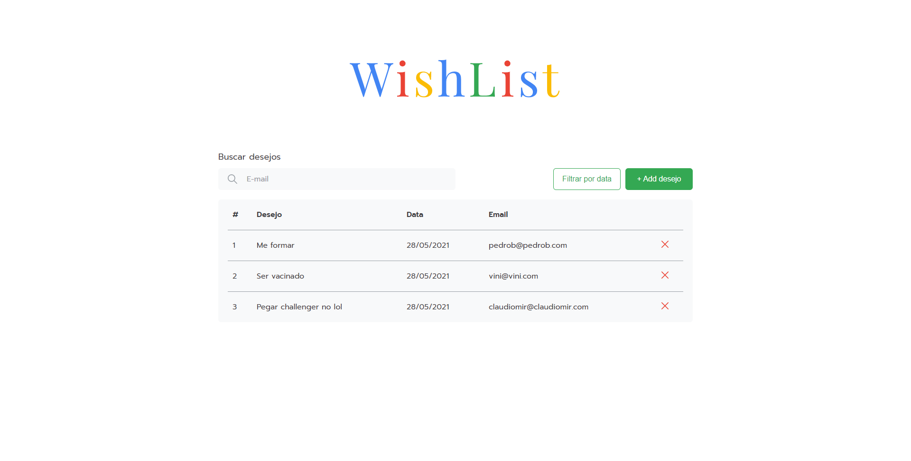
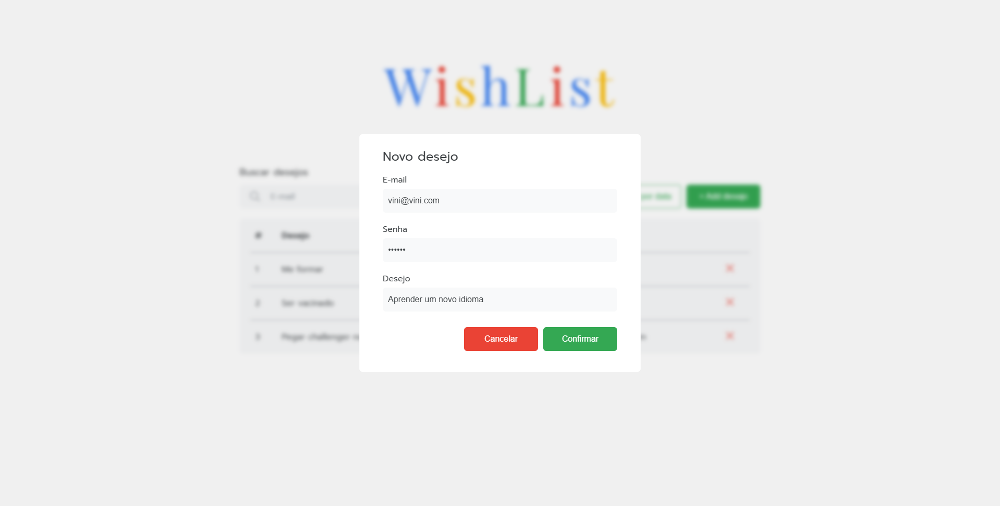

<h1 align="center">
  
</h1>
 
 

  

 

## Sobre o projeto 💬
O **WishList** é uma simples aplicação web onde é possível cadastrar, listar, excluir, e filtrar todos os seus desejos. Quais? O que você quiser! Os dados são armazenados em um banco de dados, podem ser acessados e alterados pela API que por sua vez é consumida pela UI que exibe para o usuário as informações

Para desenvolver esta aplicação foi utilizado metodologias ágeis Scrum e Kanban, facilitando a organização, designação de tarefas e definição de prazos de entrega.

Além de mim, os desenvolvedores que participaram deste projeto, foram: *[Vinícius Figueiroa](https://github.com/vinixiii)*, *[Claudiomir](https://github.com/Pedro-B-Alves)*, e *[Pedro Felipe](https://github.com/Pedro-B-Alves)*

## Páginas 🔖
Essa aplicação possui apenas uma página e um modal:
<h3 align="center">Home</h3>

  

<h3 align="center">Home-Modal</h3>

  

## Funcionalidades 🧠
A aplicação contém todas as seguintes funcionalidades:
- Exibir todos os desejos cadastrados
- Cadastrar um novo desejo
- Excluir um desejo
- Filtrar por data mais recente ou mais antiga
- Filtrar os desejos de um usuário pelo e-mail

Além disso, possui validações na UI que trazem uma ótima experiência ao usuário.

## Como utilizar? 📌
Para utilizar a aplicação em sua máquina é necessário ter os seguintes softwares instalados:
- [Node.js](https://nodejs.org/pt-br/)
- [.NET 5.0](https://dotnet.microsoft.com/download)
- [SQL Server](https://www.microsoft.com/pt-br/sql-server/sql-server-downloads?rtc=1)
- [SQL Server Management Studio (SSMS)](https://docs.microsoft.com/pt-br/sql/ssms/download-sql-server-management-studio-ssms?view=sql-server-ver15)

Com os software citados acima instalados, basta seguir os seguintes passos para executar a aplicação em sua máquina:
1. **Clonar o projeto**  
Abra o terminal em uma pasta de sua preferência e cole o seguinte código: *`git clone https://github.com/Pedro-B-Alves/WishList.git`*

2. **Criar o banco de dados**  
No SSMS do SQL Server execute os scripts que estão em *`WishList\db`*

3. **Configurar o acesso ao banco de dados na API**  
No caminho *`WishList\back-end\Senai_WishList\Senai_WishList\Contexts`* abra o arquivo *`WishlistContext.cs`* no editor de texto de sua prefêrencia e altere na *`linha 29`* a string de conexão do banco de dados de acordo com suas credenciais de acesso

4. **Instalar as dependências**  
Abra o terminal no caminho *`WishList\front-end\senai_wishlist-ui`* e digite *`npm install`*

5. **Executar a API**  
Abra o terminal no caminho *`WishList\back-end\Senai_WishList\Senai_WishList`* e digite *`dotnet run`*

6. **Executar a UI**  
Abra o terminal no caminho *`WishList\front-end\senai_wishlist-ui`* e digite *`npm start`*

## Tecnologias 🛠
Desenvolvido utilizando as seguintes tecnologias:
- [React](https://reactjs.org)
- [C#](https://docs.microsoft.com/pt-br/dotnet/csharp/)
- [Entity Framework Core](https://docs.microsoft.com/pt-br/ef/)
- [ASP.NET Core](https://docs.microsoft.com/pt-br/aspnet/core/?view=aspnetcore-5.0)
- [SQL Server](https://docs.microsoft.com/pt-br/sql/?view=sql-server-ver15)

---

Feito por: Pedro Henrique Brito Alves 🙋🏻‍♂️

